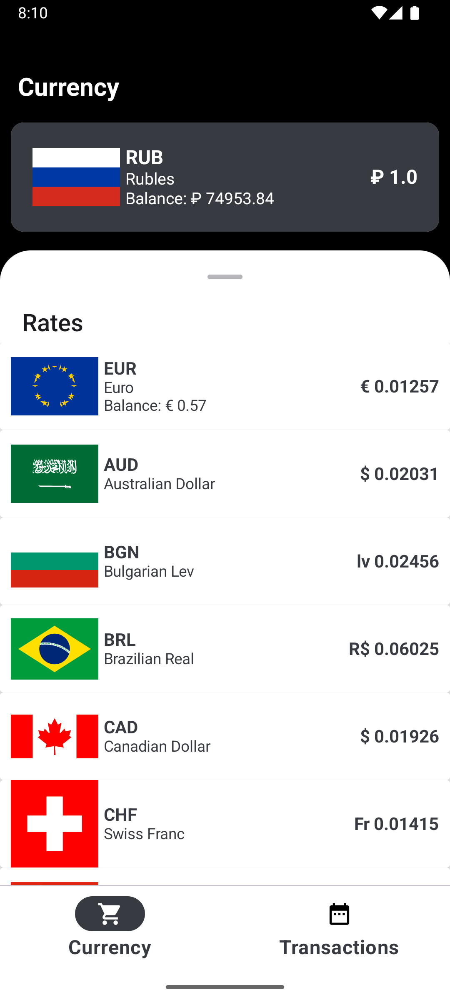
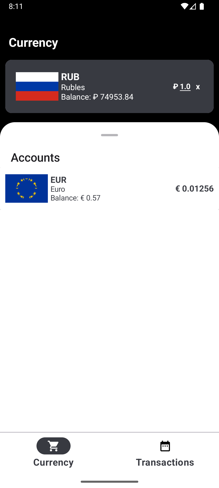
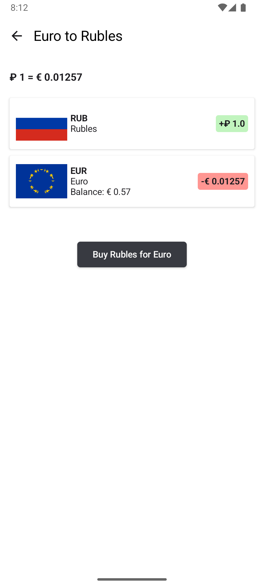
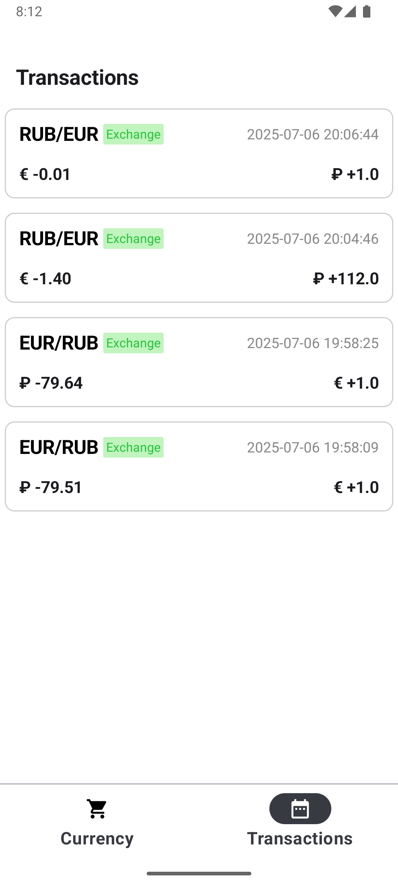

# Currency Converter App

A modern currency converter and transaction tracker built with **Jetpack Compose**, **MVVM**, **Hilt**, and **Kotlin Coroutines**. This app allows you to monitor exchange rates, manage accounts, and track your currency transactions in an intuitive and elegant interface.

---

## 📱 Features

- Real-time currency rates
- Secure transactions between accounts
- Clear overview of balances
- Local database storage
- Smooth animations with shimmer loading indicators
- Fully responsive UI built with Jetpack Compose

---

## 🚀 Technologies

- Jetpack Compose for declarative UI
- Hilt for dependency injection
- Room for local data persistence
- Kotlin Coroutines + StateFlow for reactive state management
- Navigation Compose for screen transitions

---

## 🗺️ Screens

- **Currency Screen**: shows current exchange rates, allows selecting a target currency, and supports quick recalculations.
- **Accounts Screen**: displays balances of all available currencies and lets you monitor your funds.
- **Exchange Screen**: provides a flow to exchange amounts between accounts with validation and confirmation steps.
- **Transactions Screen**: lists all past currency exchanges, showing date, amount, and direction of each transaction.

---

## 📸 Screenshots

<p align="center">
  
  
  
  
</p>

---

## ⚙️ Setup

```bash
git clone https://github.com/simadimonyan/currency-converter-app.git
```

Open the project in **Android Studio**, sync Gradle, and build the project. Then run the app on your emulator or connected device.

---

## 📂 Project Structure

```plaintext
currencyconverter
├── data
│   └── dataSource
│       ├── remote
│       │   ├── dto
│       │   │   └── RateDto.kt
│       │   ├── RatesService.kt
│       │   └── RemoteRatesServiceImpl.kt
│       └── room
│           ├── account
│           │   ├── dao
│           │   │   └── AccountDao.kt
│           │   └── dbo
│           │       └── AccountDbo.kt
│           ├── converter
│           │   └── Converters.kt
│           ├── transaction
│           │   ├── dao
│           │   │   └── TransactionDao.kt
│           │   └── dbo
│           │       └── TransactionDbo.kt
│           └── ConverterDatabase.kt
├── di
│   └── DatabaseProvider.kt
├── domain
│   ├── entity
│   │   ├── Balance.kt
│   │   └── Currency.kt
│   ├── repository
│   │   ├── AccountRepository.kt
│   │   ├── RateRepository.kt
│   │   └── TransactionRepository.kt
│   └── usecase
│       ├── CountByRatesUseCase.kt
│       ├── ExchangePairUseCase.kt
│       ├── GetAllTransactionsUseCase.kt
│       ├── GetOneRateCostUseCase.kt
│       └── UpdateAllBalancesUseCase.kt
├── ui
│   ├── navigation
│   │   ├── NavGraph.kt
│   │   └── Routes.kt
│   ├── screens
│   │   ├── currency
│   │   │   ├── CurrencyEvents.kt
│   │   │   ├── CurrencyScreen.kt
│   │   │   └── CurrencyViewModel.kt
│   │   ├── exchange
│   │   │   ├── ExchangeEvents.kt
│   │   │   ├── ExchangeScreen.kt
│   │   │   └── ExchangeViewModel.kt
│   │   ├── transactions
│   │   │   ├── TransactionsEvents.kt
│   │   │   ├── TransactionsScreen.kt
│   │   │   └── TransactionsViewModel.kt
│   │   └── ActivityScreen.kt
│   ├── shared
│   │   ├── components
│   │   │   ├── cards
│   │   │   │   ├── CurrencyCard.kt
│   │   │   │   ├── ExchangeCard.kt
│   │   │   │   └── TransactionCard.kt
│   │   │   ├── BottomNavigation.kt
│   │   │   └── Shimmer.kt
│   │   └── state
│   │       ├── ExchangeStateHolder.kt
│   │       ├── RateStateHolder.kt
│   │       └── TransactionsStateHolder.kt
│   ├── theme
│   │   ├── Color.kt
│   │   ├── Theme.kt
│   │   └── Type.kt
│   └── MainActivity.kt
└── App.kt
```

---

## 📄 License

This project is licensed under the MIT License. See the `LICENSE` file for details.
